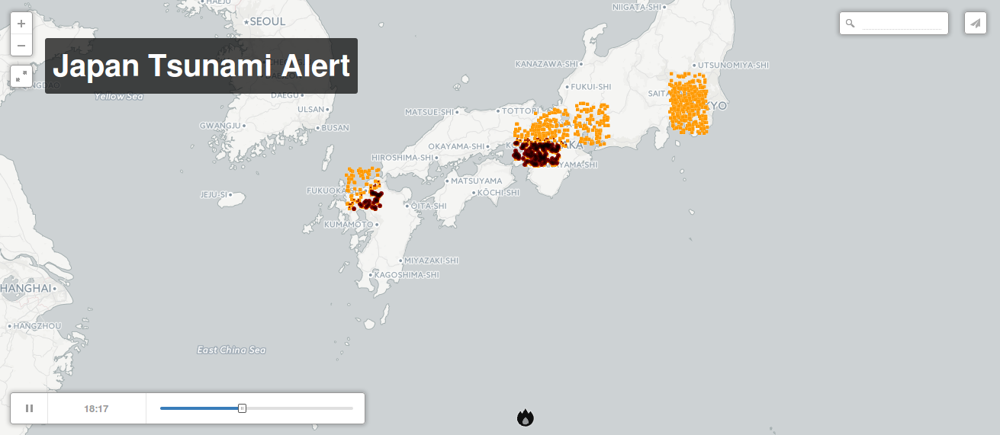

# tsunami_alert
Tsunami alert system on 100 Go on S3, AWS, Spark Scala, Python, Cassandra cluster, Redis (Scholar project, 2015)




## User guide
<br/>
### AWS cluster initialization
<br/>
#### 1. Create the right security group
http://datastax.com/documentation/datastax_enterprise/4.6/datastax_enterprise/install/installAMIsecurity.html

#### 2. Configure 6 instances (m3.2xlarge) 
http://datastax.com/documentation/datastax_enterprise/4.6/datastax_enterprise/install/installAMIlaunch.html

  - in "Advanced Details", write :
```
--clustername tsunami 
--totalnodes 6 
--version enterprise 
--username <YourUsername> 
--password <YourPassword>
--analyticsnodes 6 
--cfsreplicationfactor 2 
--opscenter Yes
```
  - select your security group (see step one)
  - create your key-pair and save it
  - launch instances
  - get hosts list from EC2 dashboard (the master is the instance with "AMI launch index" equals 0)

#### 3. give pem right
```
$ chmod 400 <YourKeyPair>.pem
```

#### 4. connect to the master to initialize datastax enterprise
```
$ ssh -i <myKeyPair>.pem ubuntu@<ip_master>
```

#### 5. from a local terminal, initialize cluster
```
$ cd /tsunami_team/script/
$ ./aws_partition_redirect.sh 
$ <myKeyPair>.pem \
$ <ip_master> \
$ <ip_host1> \
$ <ip_host2> \
$ <ip_host3> \
$ <ip_host4> \
$ <ip_host5>
```

#### 6. from the master, execute pre-processing data and insert to cassandra
```
$ setsid dse spark \
--conf  spark.executor.memory=15g \
--conf spark.core.connection.ack.wait.timeout=600 \
--conf spark.akka.frameSize=512 \
--conf spark.cassandra.output.batch.size.bytes=131072 \
-i /home/ubuntu/tsunami_alert/src/preprocessing/csv_2_cassandra.scala
```

#### 7. from the master, edit the /dataset/Node_locations.csv file with each EC2 instance ID

<br/>
**optional :**
  - check datastax enterprise dashboard on your browser :
  <br/>
  http://ec2[YourMaster].amazonaws.com:8888/opscenter/index.html
  - check spark's state directly on [Spark UI](http://localhost:4040/) 
  - check cassandra data after the insert task :
  <br/>
  ```
    $ cqlsh
  ``` 
  <br/>
  ``` 
    $ cqlsh> select * from tsunami_project.tsunami_table limit 10;
  ```
  <br/>
  ``` 
    $ cqlsh> exit
  ```

<br/>
### TSUNAMI : Alert system

<br/>
#### 1. from the master, trigger a Tsunami :
```
$ cd /home/ubuntu/tsunami_alert/src/alert_system/
$ python sms_alert.py
```

#### 2. Select longitude, latitude and Tsunami date into the terminal

#### 3. Enjoy !
**Note :**
  - Tsunami will kill the closest instance of the tsunami impact.
  <br/>
  - To visualize it, use the /dataset/res_x.csv (x is the number of tsunami replicate) :
  <br/>
    [Example with CartoDB!](hap://cdb.io/1KB1tmL)


<br/>
## Problem(s) ?
**Spark conf :**
<br/>
/etc/dse/spark/
<br/>
<br/>
**Spark log :**
<br/>
/var/lib/spark/work/
<br/>
/var/log/spark/
